# Диаграммы
## Создание схем mermaid
Mermaid — это инструмент наподобие Markdown, который преобразует текст в схемы. Например, Mermaid может отображать блок-схемы, схемы последовательностей, круговые диаграммы и др. Чтобы создать схему Mermaid, добавьте фрагмент разметки Mermaid в блок кода с ограждением, указав идентификатор языка mermaid.

Например, можно создать блок-диаграмму, указав значения и стрелки.

```
graph TD;
    A-->B;
    A-->C;
    B-->D;
    C-->D;
```

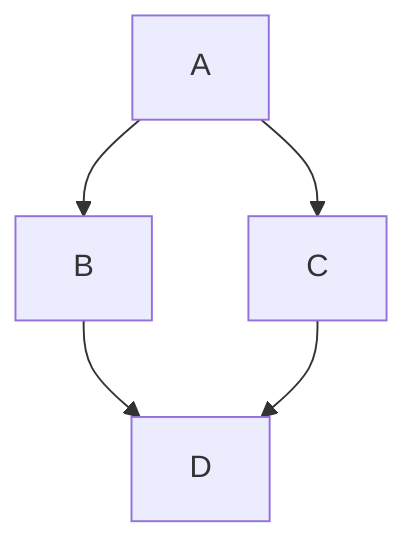

### Проверка версии русалки
Чтобы гарантировать, что GitHub поддерживает синтаксис русалки, проверьте используемую в настоящее время версию mermaid.

```
  info
```

```mermaid
  info
```
### Блок-схема
Блок-схемы — распространенный графический способ представления информации. Часто используется для визуализации работы алгоритмов. Блок-схемы обычно состоят из узлов в виде геометрических фигур и стрелок, соединяющих узлы. Mermaid позволяет создавать динамические блок-схемы. 

Блок-схема создается с помощью ключевого слова flowchart и аббревиатуры для указания направления. Имя узла указывается уже на следующей строчке. При этом важно, что нельзя создать узел с именем «end», если очень хочется, то лучше использовать «End» или «END».

```
flowchart TB
	node
```

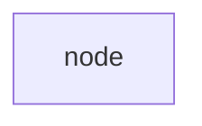

Направление блок-схемы, как уже было отмечено, задается с помощью ключевой аббревиатуры. Всего пользователю доступно 5 аббревиатур:
- TB — «top to bottom», сверху вниз;
- TD — «top-down/ same as top to bottom», сверху вниз;
- BT — «bottom to top», снизу вверх;
- RL — «right to left», справа налево;
- LR — «left to right», слева направо.

#### Узлы
В узел можно поместить любой текст, для этого после имени надо указать текст в квадратных скобках.

```
flowchart TB
  node[Текст в узле]
```

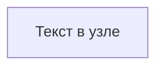

##### Форма
Сами узлы могут быть не только прямоугольными. Форма узла задается символами вокруг текста и доступны следующие геометрические фигуры:

```
flowchart TB
  node1[Форма 1]  
  node2(Форма 2)
  node3([Форма 3])
  node4[[Форма 4]]
  node5[(Форма 5)]
  node6((Форма 6))
  node7>Форма 7]
  node8{Форма 8}
  node9{{Форма 9}}
  node10[/Форма 10/]
  node11[\Форма 11\]
  node12[/Форма 12\]
  node13[\Форма 13/]
```

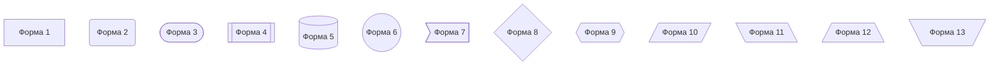

##### Экранирование
Иногда в самом тексте надо разместить специальные символы, которые в процессе рендеринга могут сломать всю конструкцию. Для этих целей доступно экранирование в виде кавычек. Все содержимое в кавычках по умолчанию принимается за текст.

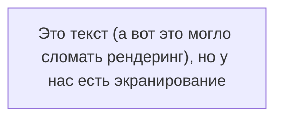

#### Стрелки
Узлы в блок-схеме соединяются с помощью стрелок и линий. В коде они указываются следующим образом:

```
flowchart TB
А --> B
C --- D
E -.-> F
G ==> H
I --o J
K --x L
```

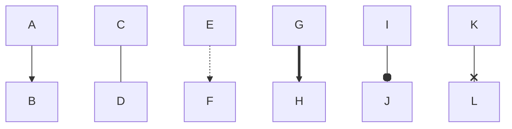

##### Текст
Так же как и в обычной блок-схеме, в Mermaid можно указывать вопрос или размещать текст на стрелках и связях узлов. Для этого достаточно ввести необходимый текст в конструкцию стрелки:

```
flowchart TD
    A-- Text ---B
    C---|Text|D 
    E-->|text|F 
    G-- text -->H 
    I-. text .-> J 
    K == text ==> L
```

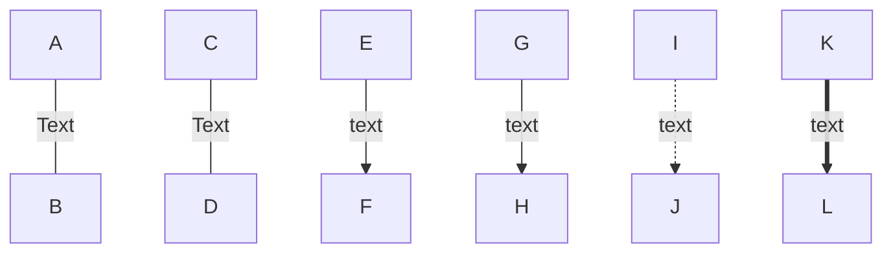

Система рендеринга автоматически подбирает длину стрелок и соединений, но если надо явно задать большую длину, то можно указать большее количество дефисов.

#### Подсхемы
Зачастую на одной блок-схеме необходимо показать взаимосвязанную работу двух алгоритмов. Для этих целей подойдут подсхемы, позволяющие визуально разделять несколько сущностей на одном рисунке. Задаются они следующей конструкцией:

```
subgraph название
    описание графа
end
```

Пример:

```
flowchart TB
    c1-->a2
    subgraph one
    a1-->a2
    end
    subgraph two
    b1-->b2
    end
    subgraph three
    c1-->c2
    end
```

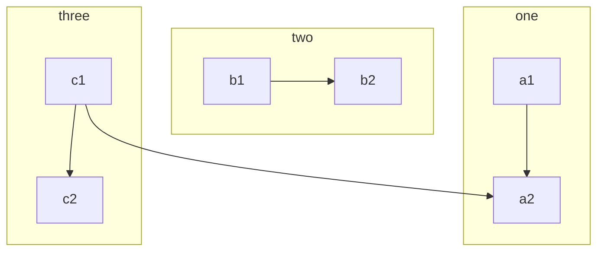

#### Узел-кнопка (не работает в GitHib)
Узел можно сделать кнопкой, открывающей страницу в браузере. Для этого надо указать ссылку в описании узла. Ссылку необходимо экранировать кавычками:

```
flowchart TB
%% создаем узел
    A --> B 
%% Кстати да, комментарии задаются двумя знаками процента
%% Описываем действия для клика по узлу

click A "http://www.github.com"
```

После этого узел A станет кликабельным и по клику будет открываться страница, находящаяся по ссылке. Но проблема в том, что ссылка будет открываться в активной вкладке, что может быть неудобно. Проблему можно решить и указать в конце ссылке ключевое слово _blank.

```
flowchart TB
    A --> B 
    click A "http://www.github.com" _blank
```

**Но это не работает в GitHub из-за ограничений по безопасности, только JavaScript!**

Полное описание:
##### Переход по ссылке (click nodeName "URL")
Вы можете привязать веб-ссылку к узлу.

```
flowchart LR
    A[Нажми на меня] --> B(Google)
    click A "https://google.com"
    click B "https://google.com" _blank "Открыть в новой вкладке"
```

Синтаксис: click узел "URL" [цель] ["всплывающая подсказка"]
- цель (target): необязательный параметр, например _blank для открытия в новой вкладке (по умолчанию _self).
- подсказка: необязательный текст, появляющийся при наведении.
##### Вызов JavaScript-функции
Вы можете вызвать функцию JavaScript, которая должна быть определена на странице, где отображается диаграмма.
```
flowchart LR
    A[Кнопка]
    click A call alert("Узел нажат!")
```
Синтаксис: click узел call функция()

#### Цвета
Узлам можно задавать альтернативные цвета. При этом для каждого отдельно взятого узла можно задать свой цвет. Для этого после описания блок-схемы необходимо написать ключевое слово style, после указать имя узла, а потом описать цветовую схему. Цветовая схема задается с помощью следующих тегов:
- fill — заливка;
- stroke — цвет границы;
- stroke-width — толщина границы;
- color — цвет текста;
- stroke-dasharray — пунктирная граница (аргументы - 2 числа:
	- первое число - длина штриха в пикселях (dash);
	- второе число - длина пробела (gap) между штрихами, тоже в пикселях).

```
flowchart LR
    id1(Start)-->id2(Stop)
    style id1 fill:#3f3,stroke:#333,stroke-width:4px
    style id2 fill:#ff2400,stroke:#333,stroke-width:4px,color:#fff,stroke-dasharray: 12 5
```

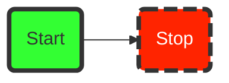

#### Классы стилей
Если блок-схема большая, то может быть неудобно для каждого элемента расписывать его свойства. Для этого есть возможность создавать классы стилей и применять их. Класс объявляется с помощью ключевого слова classDef, далее следует название класса и теги через запятую. Применять стиль можно с помощью трех двоеточий после имени узла (:::).

```
flowchart LR
    classDef class1 fill:#3f3,stroke:#333,stroke-width:4px
    classDef class2 fill:#ff2400,stroke:#333,stroke-width:4px,color:#fff,stroke-dasharray: 12 5
    
    A:::class1 --> B:::class2
```

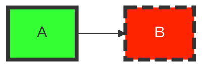

#### Финальный пример
Если применить все полученные знания, то можно построить вот такую несложную блок-схему.

```
flowchart TD
    classDef class1 fill:#7FFFD4, stroke:#000, stroke-width:4px

    A([Нам нужна диаграмма]):::class1
    B{Диаграмма динамическая?}:::class1
    A--->B
    B--Да-->C([Лучше воспользоваться Mermaid.js]):::class1 
    B--Нет-->D([Можно просто нарисовать и вставить с помощью Markdown]):::class1
```

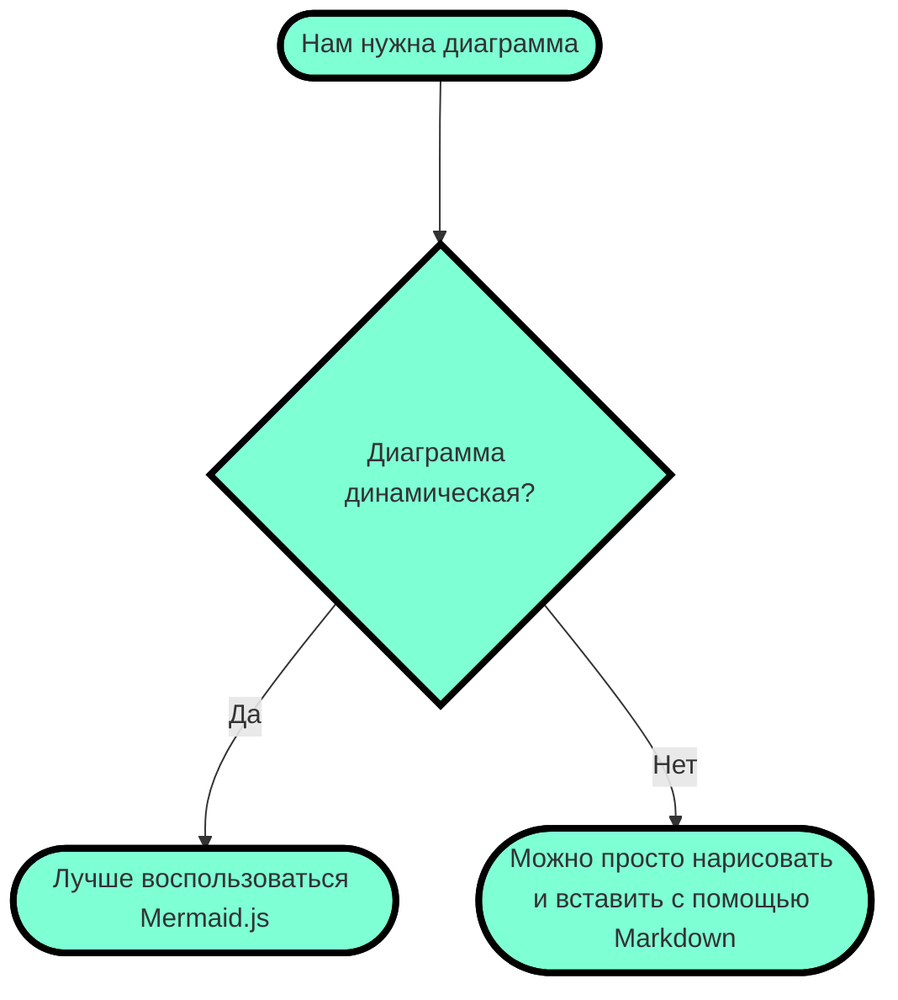

### UML-диаграммы
UML-диаграммы обычно используются для схематичного отображения классов и их связей в коде. Mermaid позволяет создавать диаграммы классов с помощью ключевого слова classDiagram. Каждый экземпляр класса содержит в себе три составляющие:
- в верхней части располагается название класса и необязательное описание;
- в центральной части находятся атрибуты класса, которые указываются со строчной буквы и выравниваются по левому краю;
- в нижней части размещены методы класса.

Есть два способа задать поля класса. Результаты рендеринга одинаковые, но второй способ занимает меньше места и требует меньше кода:

```
classDiagram
    class BankAccount
    BankAccount : +String owner
    BankAccount : +Bigdecimal balance
    BankAccount : +deposit(amount)
    BankAccount : +withdrawl(amount)
```

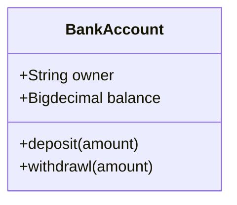

Или

```
classDiagram
class BankAccount{
    +String owner
    +BigDecimal balance
    +deposit(amount)
    +withdrawl(amount)
}
```

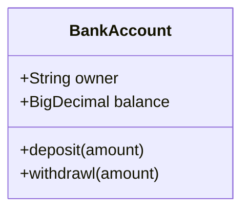

Модификаторы доступа полей класса условно задаются с помощью символов перед самим полем:
- \+ — public;
- \- — private;
- \# — protected;
- \~ — package.

Отношения между классами задаются с помощью различных видов стрелок, общая модель выглядит следующим образом:
	[класс][стрелка][класс]
|Тип|Описание|
|-|-|
|<\|--|Наследование|
|*--|Композиция|
|o--|Агрегация|
|-->|Ассоциация|
|--|Ссылка (сплошная)
|..>|Зависимость|
|..\|>|Реализация|
|..|Ссылка (пунктирная)|

```
classDiagram
classA <|-- classB
classC *-- classD
classE o-- classF
classG <-- classH
classI -- classJ
classK <.. classL
classM <|.. classN
classO .. classP
```

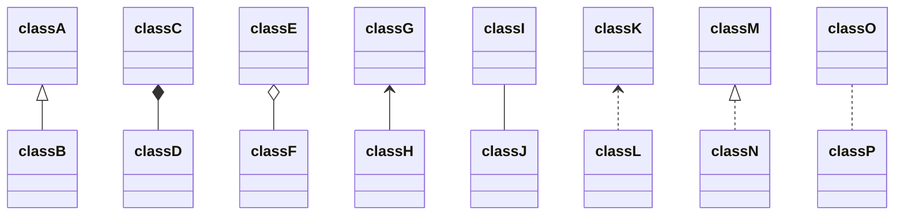

При желании можно явно указать вид связи в виде текста:
	classE --o classF : Агрегация

Двусторонние отношения задаются с помощью дублированной стрелки, направленной в обе стороны:

```
classDiagram
    Animal <|--|> Zebra
```

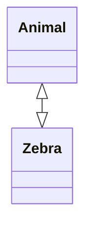

Всего двусторонние отношения возможны для следующих видов взаимоотношений:

|Тип|Описание|
|-|-|
|<\||Наследование|
|*|Композиция|
|o|Агрегация|
|>|Ассоциация|
|<|Ассоциация|
||>|Реализация|

Всего поддерживаются следующие типы множественного наследования:
- 1 — только один;
- 0..1 — ноль или один;
- 1..* — один или больше;
- \* — много;
- n — n-ое количество;
- 0..n — от нуля до n;
- 1..n — от единицы до n.

Задается множественное наследование следующим образом:

```
classDiagram
    Customer "1" --> "*" Ticket
    Student "1" --> "1..*" Course
    Galaxy --> "many" Star : Contains
```

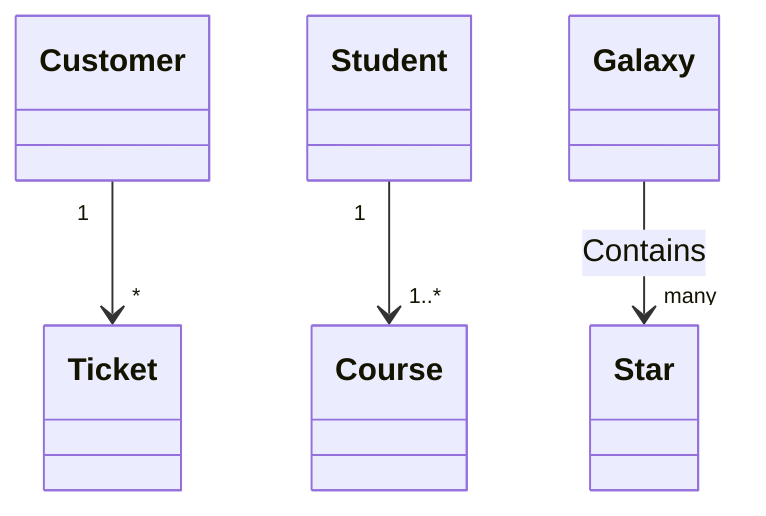

Классы можно аннотировать с помощью специальных маркеров, содержимое которых отображается в блоке с названием. Возможны 4 вида аннотаций:
- <<Interface>> — интерфейсы;
- <<abstract>> — абстрактный класс;
- <<Service>> — классы-сервисы;
- <<enumeration>> — перечисления с областью видимости.

Задать можно также двумя разными способами, которые не влияют на результаты рендеринга:

```
classDiagram
class Shape
<<interface>> Shape
Shape : noOfVertices
Shape : draw()
```

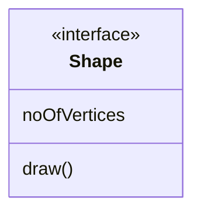

Или

```
class ShapeCopy {
    <<interface>>
    noOfVertices
    draw()
}
```

```mermaid
class ShapeCopy {
    <<interface>>
    noOfVertices
    draw()
}
```

UML-диаграммам так же как и блок-схемам можно задавать направление. Оператор направления следует указывать после ключевого слова direction.

```
classDiagram
  direction LR
  class Student {
    -idCard : IdCard
  }

  class IdCard{
    -id : int
    -name : string
  }

 Student "1" --o "1" IdCard : carries
```

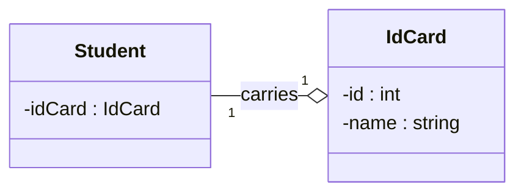

Класс UML-схемы может содержать в себе ссылку и быть кликабельным. Задается все таким же образом, как и в блок-схемах:

```
classDiagram
  direction LR
  class Student {
    -idCard : IdCard
  }
link Student "http://www.github.com"
```

```mermaid
classDiagram
  direction LR
  class Student {
    -idCard : IdCard
  }
link Student "http://www.github.com"
```

### Круговые диаграммы
Круговая диаграмма — популярный и простой способ показать какую часть от общего числа занимает отдельные части. В Mermaid круговые диаграммы задаются с помощью ключевого слова pie, далее следует слово title, позволяющее задать название диаграммы и строка с самим названием. Но titlte можно опустить и не использовать, тогда диаграмма будет безымянной.

Данные в диаграмму записываются построчно следующим образом:
- название в кавычках;
- разделитель в виде двоеточия;
- положительное числовое значение (поддерживается до двух знаков после запятой).

```
pie title Продажи легких закусок за декабрь 2021
    "Сендвичи" : 223
    "Салаты" : 50
    "Канапе" : 100
```

```mermaid
pie title Продажи легких закусок за декабрь 2021
    "Сендвичи" : 223
    "Салаты" : 50
    "Канапе" : 100
```

### Диаграммы пользовательского пути
С помощью диаграммы пользовательского пути можно продемонстрировать процесс того, как каждый тип пользователя пользуется мобильным или веб приложением. Для создания подобных схем в Mermaid есть ключевое слово journey, title также отвечает за название всей диаграммы. С помощью section можно задавать разделы. В каждом разделе указываются конкретные шаги с оценкой по десятибалльной шкале и закрепленным за действием лицом. Все эти данные следует вводить через разделитель в виде двоеточия.

```
journey
    title Процесс написания статьи
    section Поиск / изучение
      Поиск информации: 5: Я
      Структурирование: 5: Я
    section Пишем
      Пишем черновик: 5: Я
      Готовим картинки: 4: Я
    section Редактируем
        Проверяем: 3: Я
        Финальные правки: 2: Я
    section Публикация
        Публикуем: 5: Я
        Радуемся: 8: Я, Мой кот
```

```mermaid
journey
    title Процесс написания статьи
    section Поиск / изучение
      Поиск информации: 5: Я
      Структурирование: 5: Я
    section Пишем
      Пишем черновик: 5: Я
      Готовим картинки: 4: Я
    section Редактируем
        Проверяем: 3: Я
        Финальные правки: 2: Я
    section Публикация
        Публикуем: 5: Я
        Радуемся: 8: Я, Мой кот
```

### Диаграмма Ганта
Диаграмма Ганта часто применяется в приложениях для планирования и отображает процесс работы над проектом. Обычно такая диаграмма состоит из двух основных частей — временной шкалы и задач. Подобные виды отслеживания задач довольно популярны и первую версию придумали аж в 1910 году, поэтому за более чем сотню лет появились альтернативные и расширенные виды. Но у всех вариантов всегда одна и таже задача. 

В Mermaid диаграммы Ганта состоят из двух частей — на оси X находится шкала времени, а на оси Y задачи и порядок их выполнения. Такой вид диаграммы задается ключевым словом gantt, в title вписывается название. Далее следует указать формат даты, который система будет принимать для рендеринга итоговой диаграммы (dateFormat). Разделы по оси Y задаются с помощью ключевого слова section и названия раздела. А далее следует указывать сами задачи, которые состоят из короткого текста задачи, имени, даты начала и продолжительности. При этом текст задачи располагается с левой части, а остальные параметры с правой и разделяются запятой. Через ключевое слово after можно явно указать последовательность задач в рамках раздела, если этого не сделать, то система сама расположит их по порядку.

```
gantt
    title Диаграмма Ганта
    dateFormat  YYYY-MM-DD
    section Секция 1
    Задача 1         :a1, 2014-01-01, 15d
    Задача 2         :20d
    section Секция 2
    Задача 1         :2014-01-12  , 12d
    Задача 2         : 24d
```

```mermaid
gantt
    title Диаграмма Ганта
    dateFormat  YYYY-MM-DD
    section Секция 1
    Задача 1         :a1, 2014-01-01, 15d
    Задача 2         :20d
    section Секция 2
    Задача 1         :2014-01-12  , 12d
    Задача 2         : 24d
```

Для каждой задачи существуют несколько параметров, которые указывают на ее состояние:
- crit — особенно важные задачи;
- active — задачи в работе;
- done — выполненные задачи;
- milestone — вехи (единичные важные события).

```
gantt
    title Диаграмма Ганта
    dateFormat  YYYY-MM-DD
    section Секция 1
    Milestone   :milestone, a1, 2014-01-01, 15d
    Crit        :crit, a2, 2014-01-01, 15d 
    Active      :active, a3, 2014-01-01, 15d
    Done        :done, a4, 2014-01-01, 15d
```

```mermaid
gantt
    title Диаграмма Ганта
    dateFormat  YYYY-MM-DD
    section Секция 1
    Milestone   :milestone, a1, 2014-01-01, 15d
    Crit        :crit, a2, 2014-01-01, 15d 
    Active      :active, a3, 2014-01-01, 15d
    Done        :done, a4, 2014-01-01, 15d
```

### Создание трехмерных моделей STL
Синтаксис ASCII STL можно использовать непосредственно в Markdown для создания интерактивных трехмерных моделей. Чтобы отобразить модель, добавьте разметку ASCII STL в блок кода с ограждением, указав идентификатор синтаксиса stl.

Например, можно создать простую трехмерную модель:

```
solid cube_corner
  facet normal 0.0 -1.0 0.0
    outer loop
      vertex 0.0 0.0 0.0
      vertex 1.0 0.0 0.0
      vertex 0.0 0.0 1.0
    endloop
  endfacet
  facet normal 0.0 0.0 -1.0
    outer loop
      vertex 0.0 0.0 0.0
      vertex 0.0 1.0 0.0
      vertex 1.0 0.0 0.0
    endloop
  endfacet
  facet normal -1.0 0.0 0.0
    outer loop
      vertex 0.0 0.0 0.0
      vertex 0.0 0.0 1.0
      vertex 0.0 1.0 0.0
    endloop
  endfacet
  facet normal 0.577 0.577 0.577
    outer loop
      vertex 1.0 0.0 0.0
      vertex 0.0 1.0 0.0
      vertex 0.0 0.0 1.0
    endloop
  endfacet
endsolid
```

```stl
solid cube_corner
  facet normal 0.0 -1.0 0.0
    outer loop
      vertex 0.0 0.0 0.0
      vertex 1.0 0.0 0.0
      vertex 0.0 0.0 1.0
    endloop
  endfacet
  facet normal 0.0 0.0 -1.0
    outer loop
      vertex 0.0 0.0 0.0
      vertex 0.0 1.0 0.0
      vertex 1.0 0.0 0.0
    endloop
  endfacet
  facet normal -1.0 0.0 0.0
    outer loop
      vertex 0.0 0.0 0.0
      vertex 0.0 0.0 1.0
      vertex 0.0 1.0 0.0
    endloop
  endfacet
  facet normal 0.577 0.577 0.577
    outer loop
      vertex 1.0 0.0 0.0
      vertex 0.0 1.0 0.0
      vertex 0.0 0.0 1.0
    endloop
  endfacet
endsolid
```
