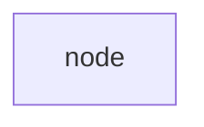
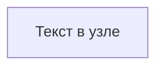
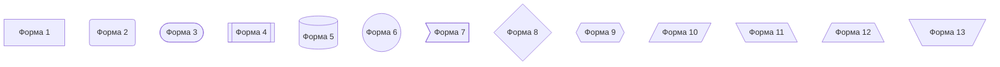
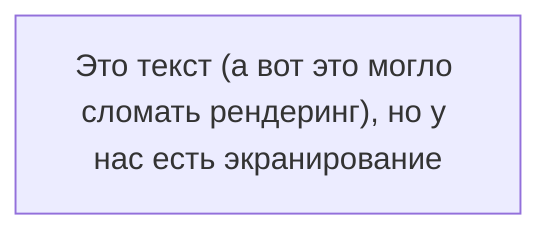
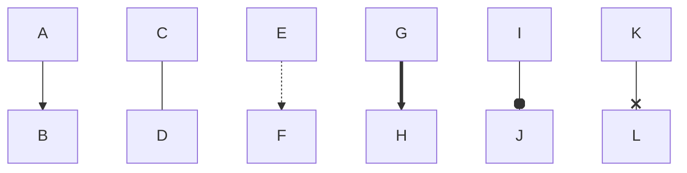
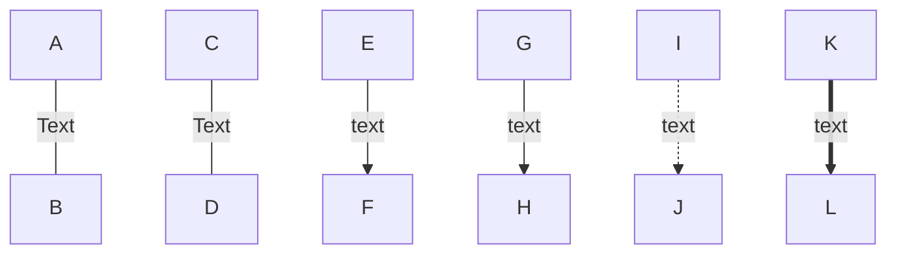
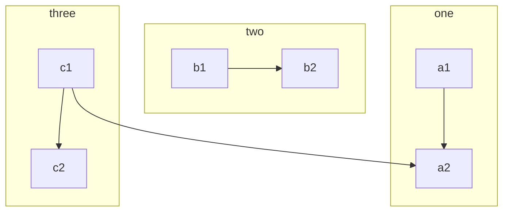
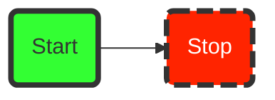
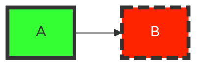
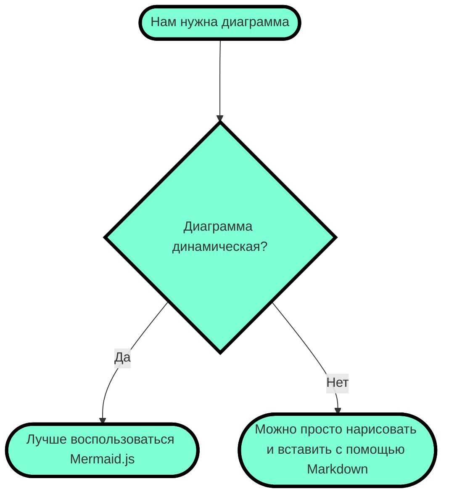

# Блок-схема
Блок-схемы — распространенный графический способ представления информации. Часто используется для визуализации работы алгоритмов. Блок-схемы обычно состоят из узлов в виде геометрических фигур и стрелок, соединяющих узлы. Mermaid позволяет создавать динамические блок-схемы. 

Блок-схема создается с помощью ключевого слова flowchart и аббревиатуры для указания направления. Имя узла указывается уже на следующей строчке. При этом важно, что нельзя создать узел с именем «end», если очень хочется, то лучше использовать «End» или «END».

```
flowchart TB
	node
```



Направление блок-схемы, как уже было отмечено, задается с помощью ключевой аббревиатуры. Всего пользователю доступно 5 аббревиатур:
- TB — «top to bottom», сверху вниз;
- TD — «top-down/ same as top to bottom», сверху вниз;
- BT — «bottom to top», снизу вверх;
- RL — «right to left», справа налево;
- LR — «left to right», слева направо.

## Узлы
В узел можно поместить любой текст, для этого после имени надо указать текст в квадратных скобках.

```
flowchart TB
  node[Текст в узле]
```



### Форма
Сами узлы могут быть не только прямоугольными. Форма узла задается символами вокруг текста и доступны следующие геометрические фигуры:

```
flowchart TB
  node1[Форма 1]  
  node2(Форма 2)
  node3([Форма 3])
  node4[[Форма 4]]
  node5[(Форма 5)]
  node6((Форма 6))
  node7>Форма 7]
  node8{Форма 8}
  node9{{Форма 9}}
  node10[/Форма 10/]
  node11[\Форма 11\]
  node12[/Форма 12\]
  node13[\Форма 13/]
```



### Экранирование
Иногда в самом тексте надо разместить специальные символы, которые в процессе рендеринга могут сломать всю конструкцию. Для этих целей доступно экранирование в виде кавычек. Все содержимое в кавычках по умолчанию принимается за текст.



## Стрелки
Узлы в блок-схеме соединяются с помощью стрелок и линий. В коде они указываются следующим образом:

```
flowchart TB
А --> B
C --- D
E -.-> F
G ==> H
I --o J
K --x L
```



### Текст
Так же как и в обычной блок-схеме, в Mermaid можно указывать вопрос или размещать текст на стрелках и связях узлов. Для этого достаточно ввести необходимый текст в конструкцию стрелки:

```
flowchart TD
    A-- Text ---B
    C---|Text|D 
    E-->|text|F 
    G-- text -->H 
    I-. text .-> J 
    K == text ==> L
```



Система рендеринга автоматически подбирает длину стрелок и соединений, но если надо явно задать большую длину, то можно указать большее количество дефисов.

## Подсхемы
Зачастую на одной блок-схеме необходимо показать взаимосвязанную работу двух алгоритмов. Для этих целей подойдут подсхемы, позволяющие визуально разделять несколько сущностей на одном рисунке. Задаются они следующей конструкцией:

```
subgraph название
    описание графа
end
```

Пример:

```
flowchart TB
    c1-->a2
    subgraph one
    a1-->a2
    end
    subgraph two
    b1-->b2
    end
    subgraph three
    c1-->c2
    end
```



## Узел-кнопка (не работает в GitHib)
Узел можно сделать кнопкой, открывающей страницу в браузере. Для этого надо указать ссылку в описании узла. Ссылку необходимо экранировать кавычками:

```
flowchart TB
%% создаем узел
    A --> B 
%% Кстати да, комментарии задаются двумя знаками процента
%% Описываем действия для клика по узлу

click A "http://www.github.com"
```

После этого узел A станет кликабельным и по клику будет открываться страница, находящаяся по ссылке. Но проблема в том, что ссылка будет открываться в активной вкладке, что может быть неудобно. Проблему можно решить и указать в конце ссылке ключевое слово _blank.

```
flowchart TB
    A --> B 
    click A "http://www.github.com" _blank
```

**Но это не работает в GitHub из-за ограничений по безопасности, только JavaScript!**

Полное описание:
### Переход по ссылке (click nodeName "URL")
Вы можете привязать веб-ссылку к узлу.

```
flowchart LR
    A[Нажми на меня] --> B(Google)
    click A "https://google.com"
    click B "https://google.com" _blank "Открыть в новой вкладке"
```

Синтаксис: click узел "URL" [цель] ["всплывающая подсказка"]
- цель (target): необязательный параметр, например _blank для открытия в новой вкладке (по умолчанию _self).
- подсказка: необязательный текст, появляющийся при наведении.
### Вызов JavaScript-функции
Вы можете вызвать функцию JavaScript, которая должна быть определена на странице, где отображается диаграмма.
```
flowchart LR
    A[Кнопка]
    click A call alert("Узел нажат!")
```
Синтаксис: click узел call функция()

## Цвета
Узлам можно задавать альтернативные цвета. При этом для каждого отдельно взятого узла можно задать свой цвет. Для этого после описания блок-схемы необходимо написать ключевое слово style, после указать имя узла, а потом описать цветовую схему. Цветовая схема задается с помощью следующих тегов:
- fill — заливка;
- stroke — цвет границы;
- stroke-width — толщина границы;
- color — цвет текста;
- stroke-dasharray — пунктирная граница (аргументы - 2 числа:
	- первое число - длина штриха в пикселях (dash);
	- второе число - длина пробела (gap) между штрихами, тоже в пикселях).

```
flowchart LR
    id1(Start)-->id2(Stop)
    style id1 fill:#3f3,stroke:#333,stroke-width:4px
    style id2 fill:#ff2400,stroke:#333,stroke-width:4px,color:#fff,stroke-dasharray: 12 5
```



## Классы стилей
Если блок-схема большая, то может быть неудобно для каждого элемента расписывать его свойства. Для этого есть возможность создавать классы стилей и применять их. Класс объявляется с помощью ключевого слова classDef, далее следует название класса и теги через запятую. Применять стиль можно с помощью трех двоеточий после имени узла (:::).

```
flowchart LR
    classDef class1 fill:#3f3,stroke:#333,stroke-width:4px
    classDef class2 fill:#ff2400,stroke:#333,stroke-width:4px,color:#fff,stroke-dasharray: 12 5
    
    A:::class1 --> B:::class2
```



## Финальный пример
Если применить все полученные знания, то можно построить вот такую несложную блок-схему.

```
flowchart TD
    classDef class1 fill:#7FFFD4, stroke:#000, stroke-width:4px

    A([Нам нужна диаграмма]):::class1
    B{Диаграмма динамическая?}:::class1
    A--->B
    B--Да-->C([Лучше воспользоваться Mermaid.js]):::class1 
    B--Нет-->D([Можно просто нарисовать и вставить с помощью Markdown]):::class1
```


