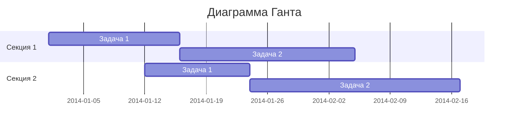
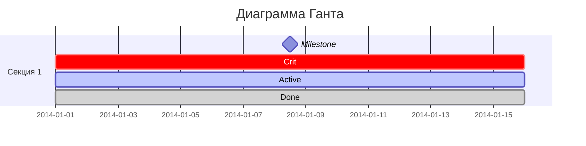

# Диаграмма Ганта
Диаграмма Ганта часто применяется в приложениях для планирования и отображает процесс работы над проектом. Обычно такая диаграмма состоит из двух основных частей — временной шкалы и задач. Подобные виды отслеживания задач довольно популярны и первую версию придумали аж в 1910 году, поэтому за более чем сотню лет появились альтернативные и расширенные виды. Но у всех вариантов всегда одна и таже задача. 

В Mermaid диаграммы Ганта состоят из двух частей — на оси X находится шкала времени, а на оси Y задачи и порядок их выполнения. Такой вид диаграммы задается ключевым словом gantt, в title вписывается название. Далее следует указать формат даты, который система будет принимать для рендеринга итоговой диаграммы (dateFormat). Разделы по оси Y задаются с помощью ключевого слова section и названия раздела. А далее следует указывать сами задачи, которые состоят из короткого текста задачи, имени, даты начала и продолжительности. При этом текст задачи располагается с левой части, а остальные параметры с правой и разделяются запятой. Через ключевое слово after можно явно указать последовательность задач в рамках раздела, если этого не сделать, то система сама расположит их по порядку.

```
gantt
    title Диаграмма Ганта
    dateFormat  YYYY-MM-DD
    section Секция 1
    Задача 1         :a1, 2014-01-01, 15d
    Задача 2         :20d
    section Секция 2
    Задача 1         :2014-01-12  , 12d
    Задача 2         : 24d
```



Для каждой задачи существуют несколько параметров, которые указывают на ее состояние:
- crit — особенно важные задачи;
- active — задачи в работе;
- done — выполненные задачи;
- milestone — вехи (единичные важные события).

```
gantt
    title Диаграмма Ганта
    dateFormat  YYYY-MM-DD
    section Секция 1
    Milestone   :milestone, a1, 2014-01-01, 15d
    Crit        :crit, a2, 2014-01-01, 15d 
    Active      :active, a3, 2014-01-01, 15d
    Done        :done, a4, 2014-01-01, 15d
```


