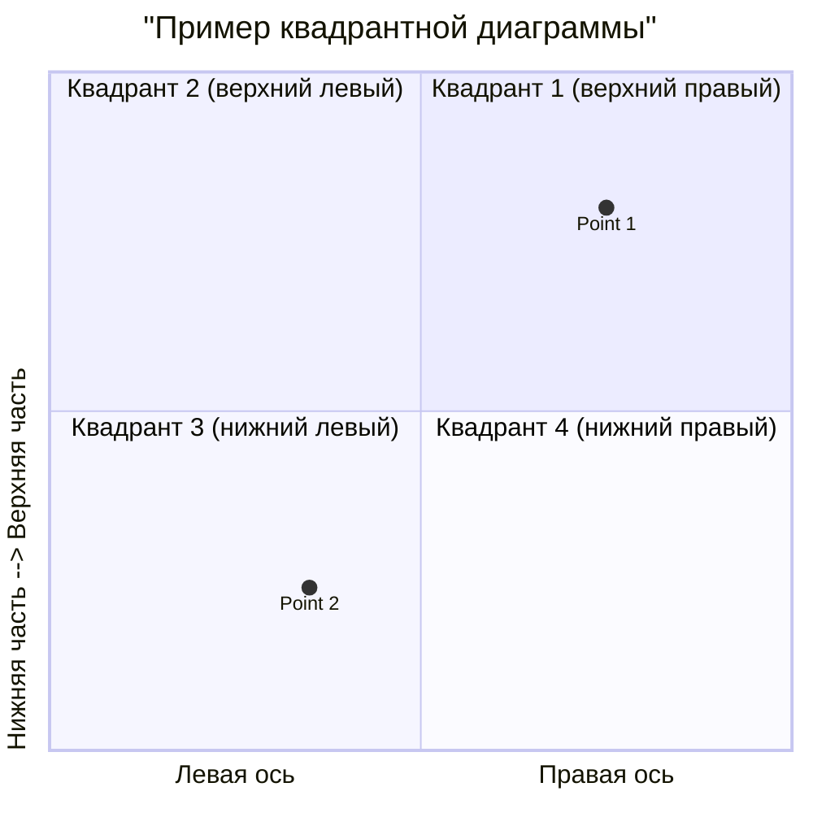
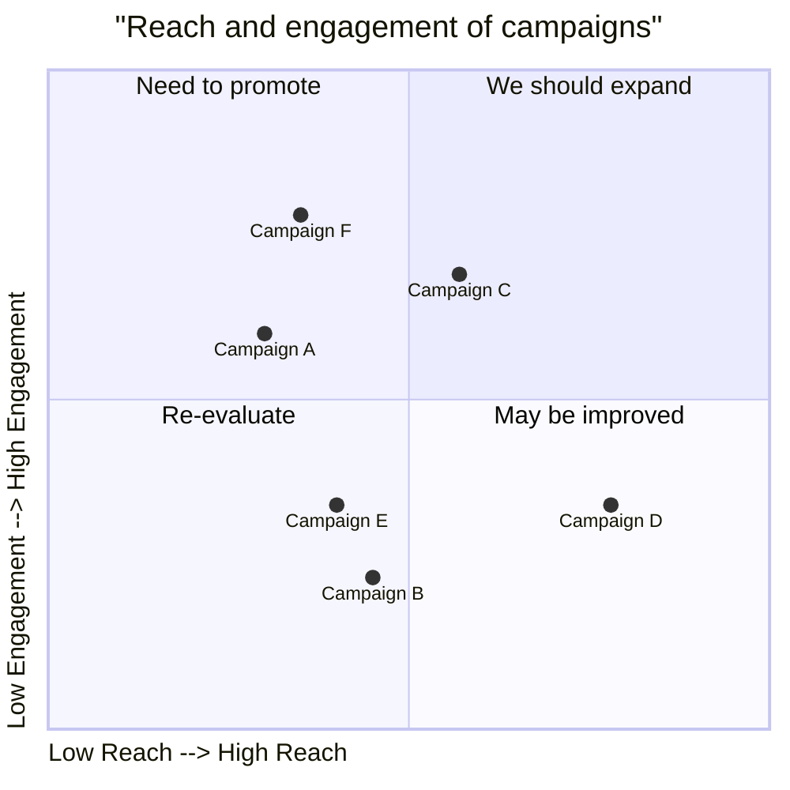

# Диаграмма квадрантов (Quadrant chart)
Квадрантная диаграмма (quadrant chart) в Mermaid — это визуальное представление данных, разделённых на четыре квадранта. Она используется для отображения точек данных на двумерной сетке, где одна переменная представлена по оси X, а другая — по оси Y. Такие диаграммы часто применяют для выявления паттернов и трендов в данных, а также для приоритизации действий на основе положения точек в диаграмме. 

## Синтаксис квадрантной диаграммы в Mermaid
Базовый синтаксис:

```
quadrantChart
    title                    "Пример квадрантной диаграммы"
    x-axis                   "Левая ось" --> "Правая ось"
    y-axis                   "Нижняя часть --> Верхняя часть"
    quadrant-1               "Квадрант 1 (верхний правый)"
    quadrant-2               "Квадрант 2 (верхний левый)"
    quadrant-3               "Квадрант 3 (нижний левый)"
    quadrant-4               "Квадрант 4 (нижний правый)"
    Point 1: [0.75, 0.80]    %% Точка 1 в верхнем правом квадранте
    Point 2: [0.35, 0.24]    %% Точка 2 в нижнем левом квадранте
```



Координаты точек находятся в диапазоне от 0 до 1:
- [0, 0] — нижний левый угол;
- [1, 1] — верхний правый угол;
- [0.5, 0.5] — центр.

Пример кода:

```
quadrantChart
    title                   "Reach and engagement of campaigns"
    x-axis                  "Low Reach --> High Reach"
    y-axis                  "Low Engagement --> High Engagement"
    quadrant-1               "We should expand"
    quadrant-2               "Need to promote"
    quadrant-3               "Re-evaluate"
    quadrant-4               "May be improved"
    Campaign A: [0.3, 0.6]
    Campaign B: [0.45, 0.23]
    Campaign C: [0.57, 0.69]
    Campaign D: [0.78, 0.34]
    Campaign E: [0.40, 0.34]
    Campaign F: [0.35, 0.78]
```



Этот пример демонстрирует диаграмму, которая сравнивает кампании по двум параметрам: охвату и вовлечённости.

## Дополнительные возможности
Настройка цвета. Можно изменить цвет заливки квадрантов. 

Стилизация точек. Точки можно стилизовать напрямую или с помощью определённых общих классов. 
