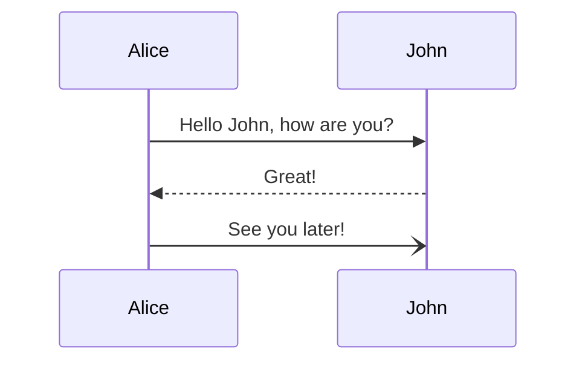
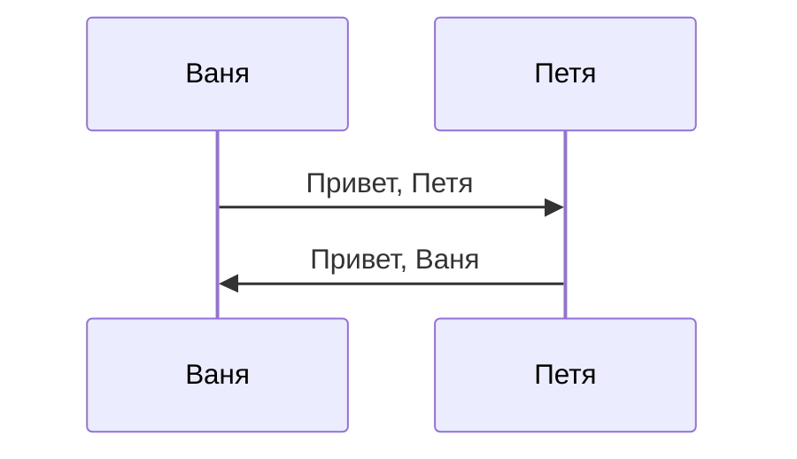
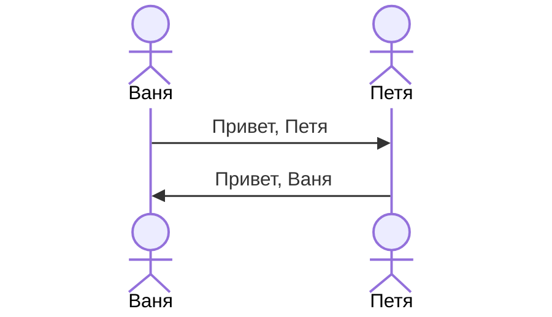
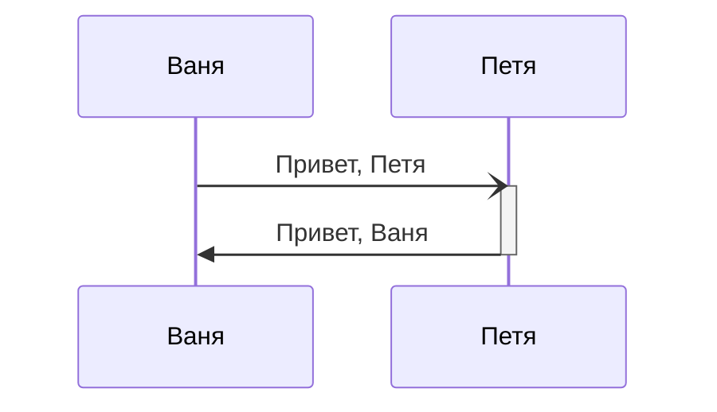
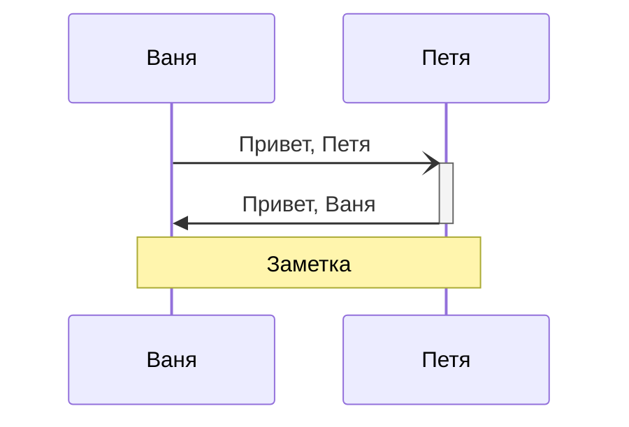
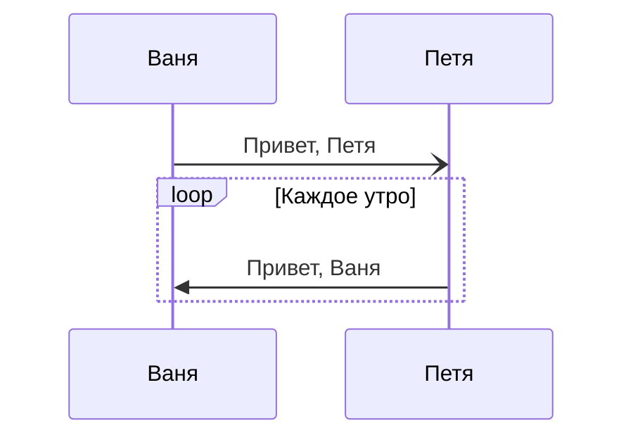
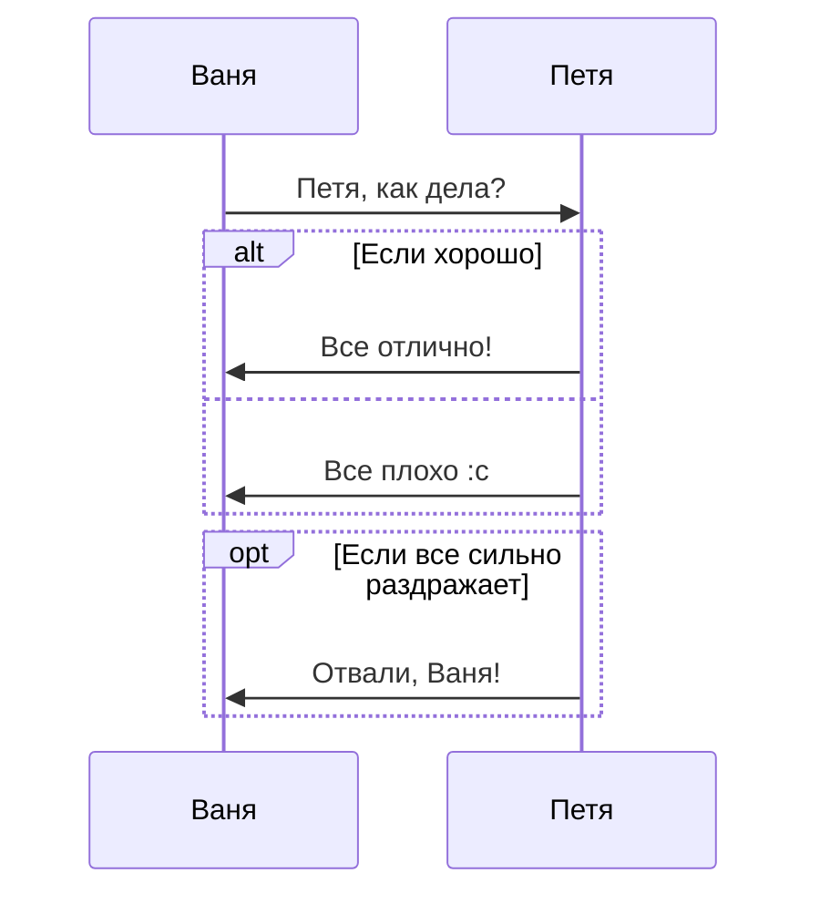
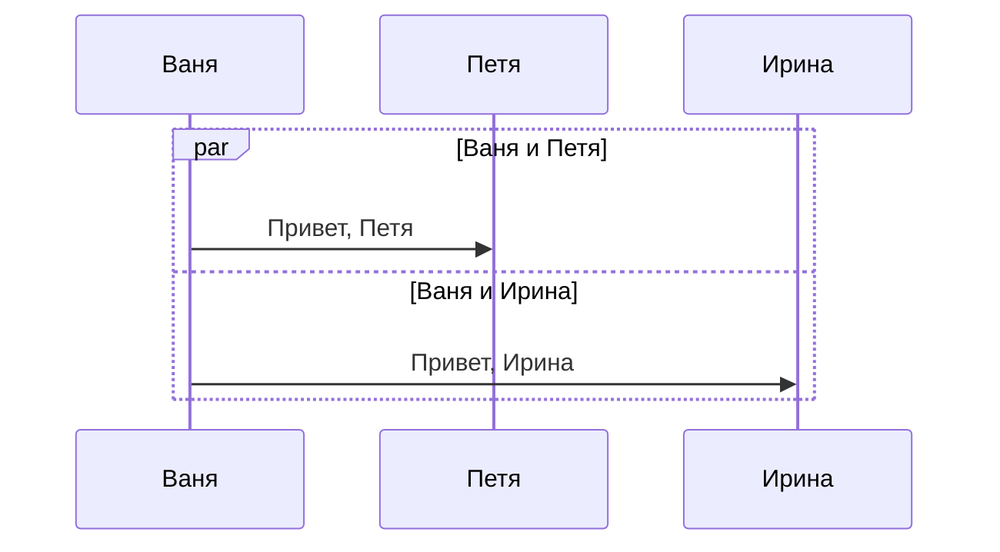
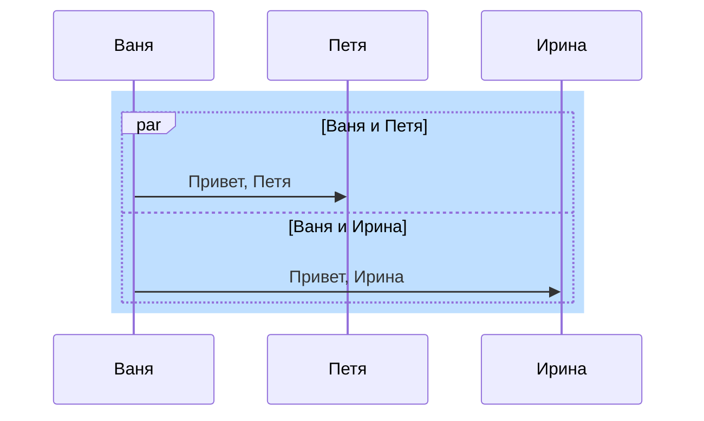
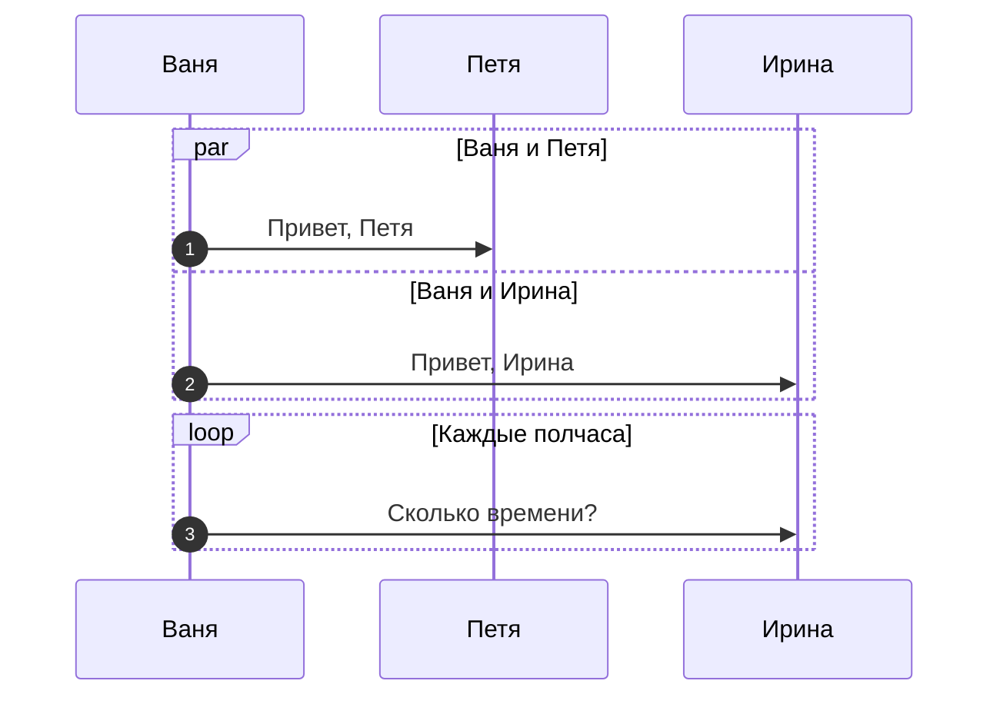

# Диаграммы последовательности

На диаграммах последовательности отображается жизненный цикл одного объекта или нескольких, а также их взаимодействие. Диаграммы последовательности состоят из актеров в виде прямоугольников и взаимодействий в виде вертикальных «линий жизни».

В Mermaid диаграммы последовательности задаются с помощью ключевого слова sequenceDiagram:

```
sequenceDiagram
    Alice->>John: Hello John, how are you?
    John-->>Alice: Great!
    Alice-)John: See you later!
```



## Актеры
Актеров можно объявлять неявно сразу во время указания отношений, а можно сначала объявить всех участников с помощью ключевого слова participant, а потом отмечать отношения.

```
sequenceDiagram
 participant Ваня
 participant Петя
 Ваня->>Петя: Привет, Петя
 Петя->>Ваня: Привет, Ваня
```



### Стикмэны
Если есть необходимость или непреодолимое желание использовать изображения стикменов вместо обезличенных прямоугольников, то для этого participant надо заменить на actor.

```
sequenceDiagram
 actor Ваня
 actor Петя
 Ваня->>Петя: Привет, Петя
 Петя->>Ваня: Привет, Ваня
```



### Псевдонимы
Каждый раз писать имя актера может быть не удобно и долго, особенно если схема состоит из десятка разных актеров. Для этих целей в Mermaid есть псевдонимы. Имя актера можно сократить до нескольких букв или буквенных идентификаторов.

```
sequenceDiagram
 participant V as Ваня
 participant P as Петя
 V->>P: Привет, Петя
 P->>V: Привет, Ваня
```


## Связи и сообщения
Связи и сообщения могут отображаться в виде сплошных или пунктирных линий. Общий вид выглядит следующим образом:

`[Актер][Стрелка][Актер]:Текст сообщения`

|Тип|Описание|
|-|-|
|->|Сплошная линия без стрелки|
|-->|Пунктирная линия без стрелки|
|->>|Сплошная линия со стрелкой|
|-->>|Пунктирная линия со стрелкой|
|-x|Сплошная линия с крестиком на конце|
|--x|Пунктирная линия с крестиком на конце|
|-)|Сплошная линия с открытой стрелки|
|--)|Пунктирная линия с открытой стелки|

## Активация и деактивация
Актера явно можно активировать и деактивировать, отмечая область его действия. Осуществляется это с помощью ключевых слов activate и deactivate. Активации можно накладывать друг на друга.

```
sequenceDiagram
 participant V as Ваня
 participant P as Петя
 V-)P: Привет, Петя
 activate P
 P->>V: Привет, Ваня
 deactivate P
```



Доступна и сокращенная запись в виде знаков «+/-» на конце стрелок, результат рендеринга будет идентичен:

```
sequenceDiagram
 participant V as Ваня
 participant P as Петя
 V-)+P: Привет, Петя
 P->>-V: Привет, Ваня
```


## Заметки
Диаграммы последовательности можно снабжать заметками с помощью общего вида записи:

`Note [ right of | left of | over ] [Актер]: Текст заметки`

Если ключевые слова right of и left of уже встречались нам ([см. файл с описанием диаграмм состояния](https://github.com/Shmetroff/test-git/blob/master/statecharts.md "Диаграммы состояния")), то слово over новое. Оно позволяет размещать заметку сразу на нескольких актерах.

```
sequenceDiagram
 participant V as Ваня
 participant P as Петя
 V-)+P: Привет, Петя
 P->>-V: Привет, Ваня
 Note over V,P: Заметка
```



## Циклы
Часто одно и то же действие происходит в цикле и активируется с определенным интервалом. В Mermaid циклы задаются с помощью ключевого слова loop:
```
loop Текст цикла
... действие ...
end
```

К примеру:

```
sequenceDiagram
 participant V as Ваня
 participant P as Петя
 V-)P: Привет, Петя

 loop Каждое утро
     P->>V: Привет, Ваня
 end
```



## Альтернативные сценарии и условия
Альтернативные сценарии и условия обозначаются следующей конструкцией:

```
alt Описание
... действие ...
else
... действие ...
end
```

Необязательные опциональные сценарии задаются без else:

```
opt Описание
... действие ...
end
```

Пример:

```
sequenceDiagram
 participant V as Ваня
 participant P as Петя
 V->>P: Петя, как дела?

 alt Если хорошо
     P->>V: Все отлично!
 else
     P->>V: Все плохо :с
 end

 opt Если все сильно раздражает
     P->>V: Отвали, Ваня!
 end
```



## Параллельные действия
Можно указать параллельные действия. Для этого есть ключевое слово par:

```
par [Действие 1]
... описание ...
and [Действие 2]
... описание ...
and [Действие N]
... описание ...
end
```

К примеру так:

```
sequenceDiagram
 participant V as Ваня
 participant P as Петя
 participant I as Ирина

 par Ваня и Петя
     V->>P: Привет, Петя
 and Ваня и Ирина 
     V->>I: Привет, Ирина
 end
```



## Цвет фона
Фону можно добавлять кастомизированные цвета с помощью RGB и RGBA кодов:

```
rect rgb(0, 255, 0)
... содержимое ...
end
```

```
rect rgba(0, 0, 255, .1)
... содержимое ...
end
```

К примеру:

```
sequenceDiagram
 participant V as Ваня
 participant P as Петя
 participant I as Ирина

 rect rgb(191, 223, 255)
     par Ваня и Петя
         V->>P: Привет, Петя
     and Ваня и Ирина 
         V->>I: Привет, Ирина
     end
 end
```



## AutoNumber
Действия на диаграмме можно автоматически пронумеровать с помощью ключевого слова autonumber в начале кода:

```
sequenceDiagram
 participant V as Ваня
 participant P as Петя
 participant I as Ирина

 autonumber
 par Ваня и Петя
     V->>P: Привет, Петя
 and Ваня и Ирина 
     V->>I: Привет, Ирина
 end
 
 loop Каждые полчаса
     V->>I: Сколько времени?
 end
```


