# Диаграмма состояния
Диаграммы состояний используются для описания поведения различных систем. По внешнему виду чем-то напоминают блок-схемы. Диаграммы состояний требуют наличия конечного количества состояний.

Mermaid умеет рендерить подобные диаграммы, а синтаксис максимально приближен к PlantUML, что должно упростить миграцию и обмен кодом. Задается диаграмма с помощью ключевого слова stateDiagram или stateDiagram-v2. Лучше использовать вторую версию рендеринга.

```
stateDiagram-v2
    [*] --> Still
    Still --> [*]

    Still --> Moving
    Moving --> Still
    Moving --> Crash
    Crash --> [*]
```

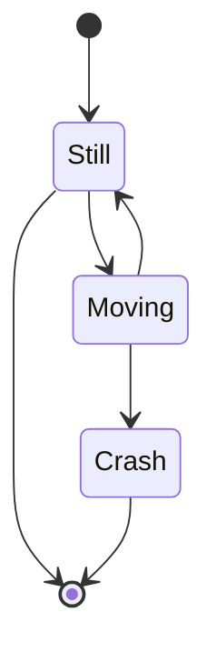

В представленной диаграмме описано три состояния — «Still» (Покой), «Moving» (Движение) и «Crash» (Столкновение). Из состояния покоя можно перейти в состояние движения и обратно, но нельзя перейти в состояние столкновения. А вот из состояния движения можно перейти в состояние столкновения.

## Состояния
Состояния задаются следующим образом:

```
stateDiagram-v2
    s1
```

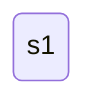

### Описание
Для описания состояния есть два пути:

```
stateDiagram-v2
    state "This is a state description" as s2
    s2 : This is a state description
```

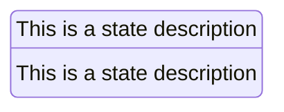

### Переходы
Переход от одного состояния к другому задается стрелками:

```
stateDiagram-v2
    s1 --> s2
```

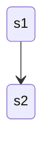

Текст перехода задается так:

```
stateDiagram-v2
    s1 --> s2: A transition
```

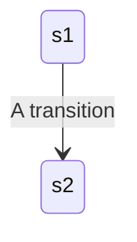

### Начало и конец
Начало и конец диаграммы обозначается с помощью символа звездочки, а далее следует стрелка направления перехода:

```
stateDiagram-v2
    [*] --> s1
    s1 --> [*]
```

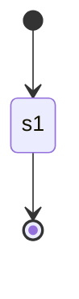

### Подсостояния
Состояния можно объединять в подсостояния и группировать между собой. Главное состояние обозначается ключевым словом state, за ним следует идентификатор, а потом фигурные скобки, в которых содержится тело подсостояния.

```
stateDiagram-v2
    [*] --> First
    state First {
        [*] --> second
        second --> [*]
    }
```

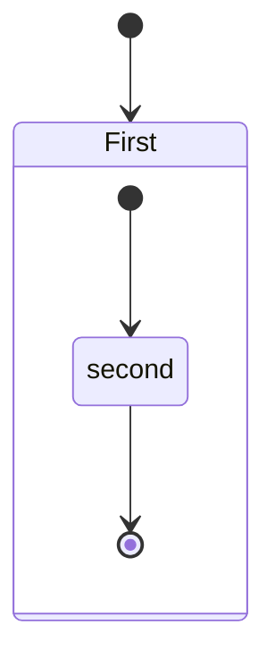

Поддерживается и вложенность в несколько уровней:

```
stateDiagram-v2
    [*] --> First

    state First {
        [*] --> Second

        state Second {
            [*] --> second
            second --> Third

            state Third {
                [*] --> third
                third --> [*]
            }
        }
    }
```

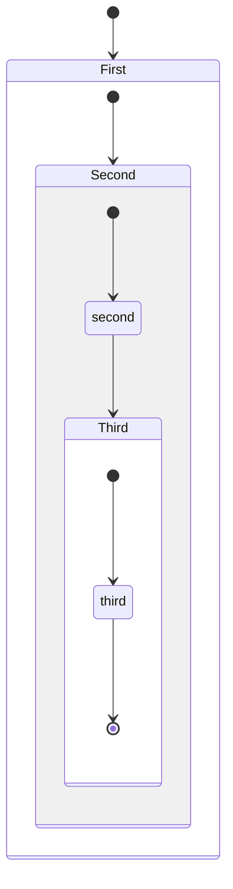

Можно оформлять переходы между несколькими подсостояниями:

```
stateDiagram-v2
    [*] --> First
    First --> Second
    First --> Third

    state First {
        [*] --> fir
        fir --> [*]
    }
    state Second {
        [*] --> sec
        sec --> [*]
    }
    state Third {
        [*] --> thi
        thi --> [*]
    }
```

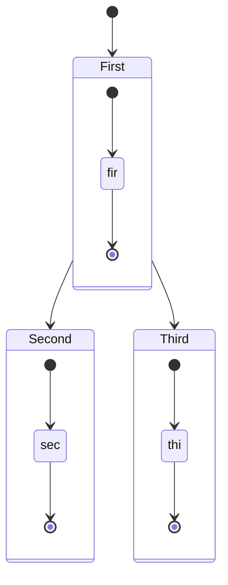

### Выбор
Выбор состояния может зависеть от определенного условия. Для организации выбора используется ключевое слово choice:

```
stateDiagram-v2
    state if_state <<choice>>
    [*] --> IsPositive
    IsPositive --> if_state
    if_state --> False: if n < 0
    if_state --> True : if n >= 0
```

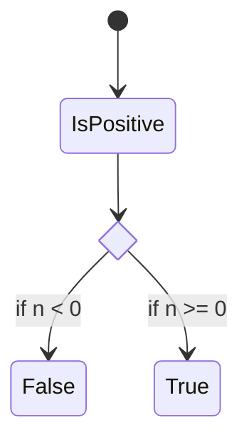

### Слияние
Несколько состояния могут сливаться в одно общее. Для этого состояния, которые сливаются, отмечают ключевым словом fork, а состояние в которое происходит слияние, отмечают словом join.

```
stateDiagram-v2
    state fork_state <<fork>>
      [*] --> fork_state
      fork_state --> State2
      fork_state --> State3

      state join_state <<join>>
      State2 --> join_state
      State3 --> join_state
      join_state --> State4
      State4 --> [*]
```

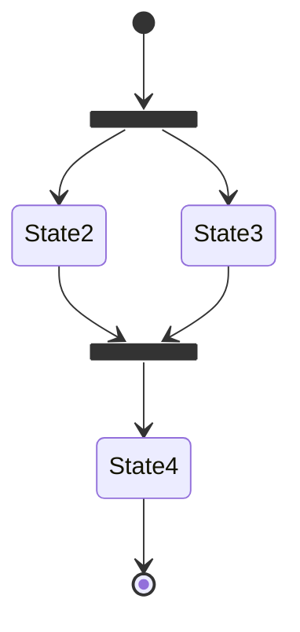

### Заметки
К состояниям можно добавлять поясняющие заметки. Для этого существует ключевое слово note, после важно указать сторону с помощью right of или left of. Доступно два варианта записи в коде — один более подробный, другой компактнее:

```
stateDiagram-v2
        State1: The state with a note
        note right of State1
            Important information! You can write
            notes.
        end note
        State1 --> State2
        note left of State2 : This is the note to the left.
```

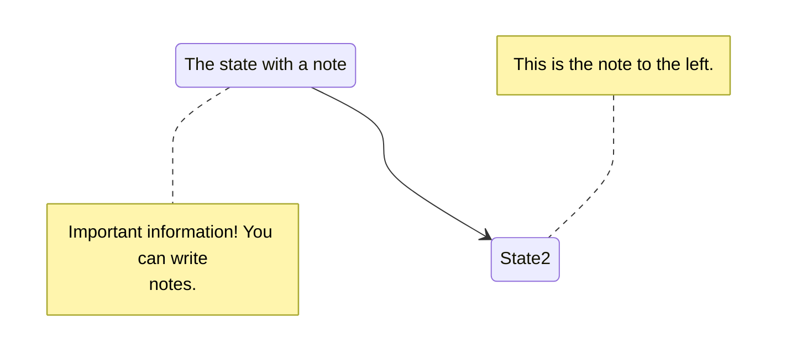

## Направление диаграммы
Направление диаграммы указывается после ключевого слова directions ([см. файл с описанием блок-схем](https://github.com/Shmetroff/test-git/blob/master/flowcharts.md "Блок-схемы"), там указаны все возмоные направления).
