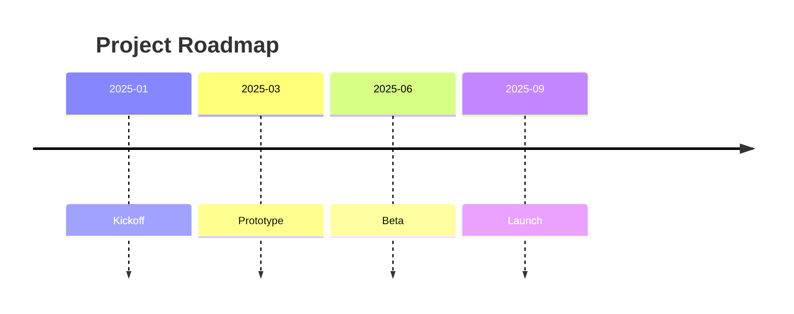
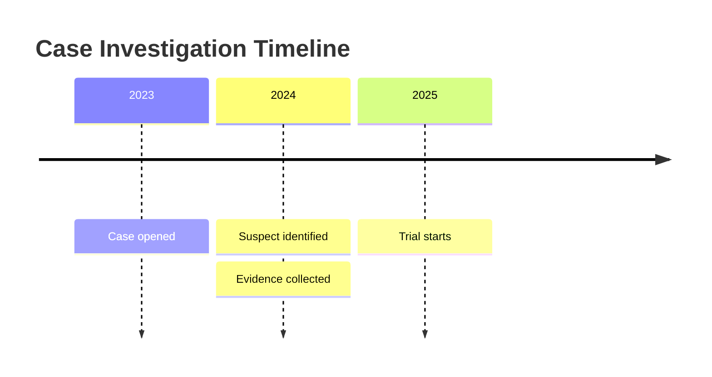

# Временная шкала (Timeline)
Базовый синтаксис временной линии в Mermaid
Чтобы создать временную линию, нужно начать с ключевого слова timeline. Далее можно добавить заголовок (с помощью ключевого слова title), а затем перечислить временные периоды и события. 

Пример синтаксиса:

```
timeline
    title Project Roadmap
    2025-01 : Kickoff
    2025-03 : Prototype
    2025-06 : Beta
    2025-09 : Launch
```



Объяснение элементов:
- timeline — обязательное ключевое слово, указывающее на создание временной линии.
- title — заголовок временной линии, который отображается в верхней части диаграммы.
- YYYY-MM — формат дат событий (четыре цифры года и два месяца). Дни указывать не обязательно.
- После двоеточия указывается описание события — текст, который отображается рядом с точкой на временной линии.
 
Важно: порядок событий в коде не влияет на их расположение — Mermaid автоматически упорядочивает их по хронологии на основе дат. 

```
timeline
    title Case Investigation Timeline
    2023 : Case opened
    2024 : Suspect identified : Evidence collected
    2025 : Trial starts
```


