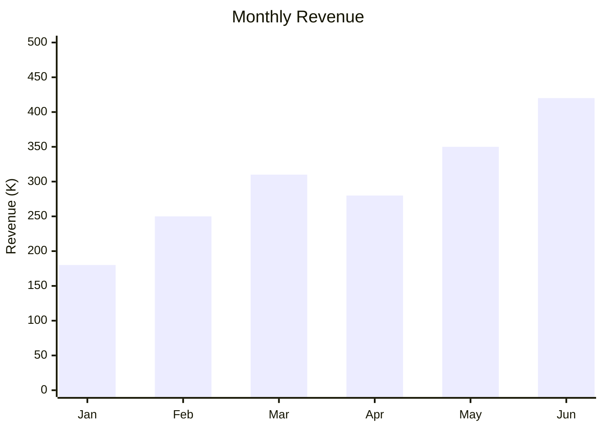

# Графики по осям X и Y (XYChart)
XY-диаграммы в Mermaid — это инструмент визуализации данных, который использует две оси (X и Y) для представления информации. На момент 2025 года в Mermaid поддерживаются два основных типа таких диаграмм: столбчатые (bar) и линейные (line). 

## Пример синтаксиса
Базовый пример создания столбчатой диаграммы:

```
xychart-beta
title "Monthly Revenue"
x-axis [Jan, Feb, Mar, Apr, May, Jun]
y-axis "Revenue (K)" 0 --> 500
bar [180, 250, 310, 280, 350, 420]
```



В этом примере:
- title — заголовок диаграммы;
- x-axis — ось X, которая может представлять категории (например, месяцы) или числовой диапазон;
- y-axis — ось Y с числовыми значениями;
- bar — тип диаграммы (столбчатая);
- [data values] — массив числовых данных.

Базовый пример создания линейной диаграммы:

```
xychart-beta
title "User Growth"
x-axis [Jan, Feb, Mar, Apr, May, Jun]
line [1200, 1800, 2500, 3100, 3800, 4500]
```

```mermaid
xychart-beta
title "User Growth"
x-axis [Jan, Feb, Mar, Apr, May, Jun]
line [1200, 1800, 2500, 3100, 3800, 4500]
```

Описание элементов:
- title — заголовок диаграммы, который отображается поверх диаграммы. 
- x-axis — метки для горизонтальной оси. Можно использовать категориальные значения или числовой диапазон.
- y-axis — метка оси Y и её диапазон.
- line — данные для построения линии. Значения должны быть числовыми.

## Дополнительные возможности
Ориентация диаграммы. По умолчанию диаграмма рисуется вертикально, но можно задать горизонтальное расположение с помощью ключевого слова horizontal. 
Заголовок. Добавляется с помощью ключевого слова title. 
Настройка тем. Цвета элементов диаграммы можно кастомизировать с помощью параметров темы (например, titleColor, backgroundColor, plotColorPalette). 
Несколько рядов данных. Можно добавлять несколько столбчатых или линейных диаграмм, каждая из которых будет иметь уникальный цвет из палитры. 
